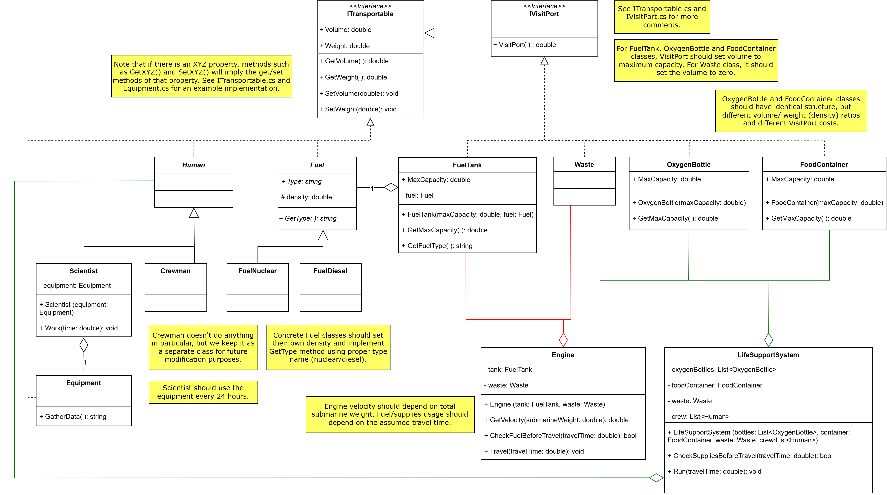
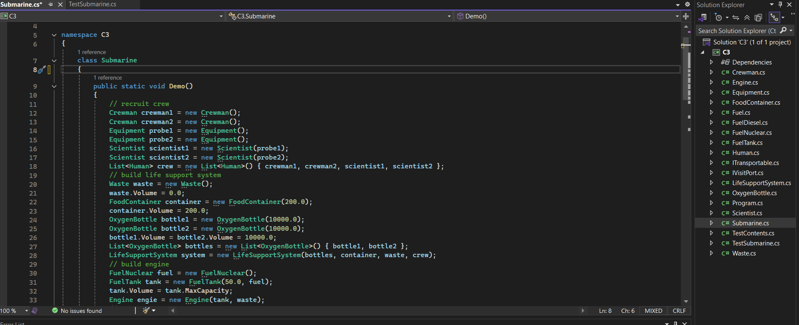
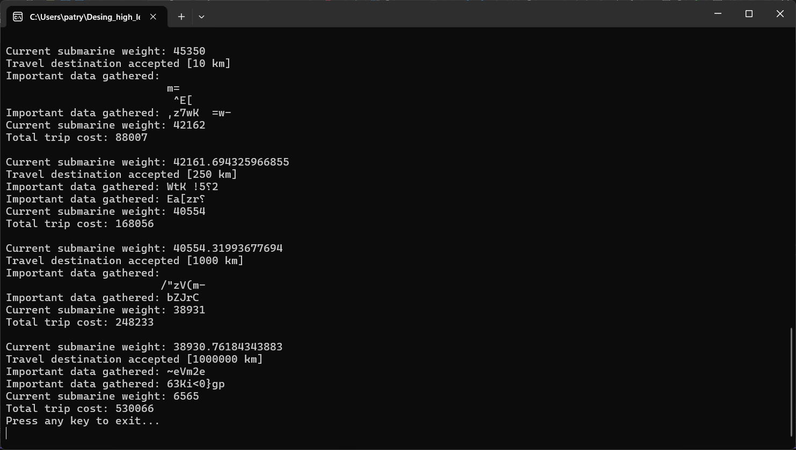
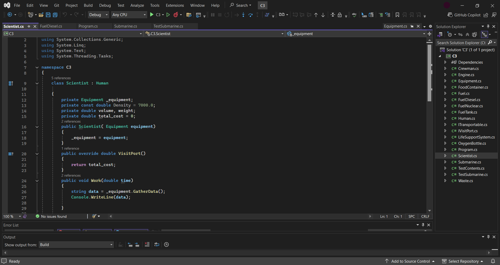
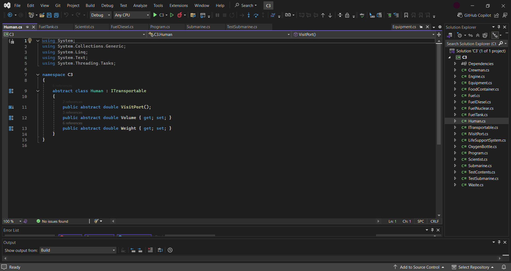

# Submarine system
Files for a project simulating submarine operations. This project is written in C# and has been designed using UML graph. It uses aggregation, realization and inheritance.  	
Project is created with Visual Studio 2022.

UML diagram
  

Code for Submarine
  
In this part there is a class called Submarine which runs demo for the operation of the boat. It creates crew, needed supplies and configures engine.  

Console outpute
  

Aggregation and inheritance example
   

Realization example
  

